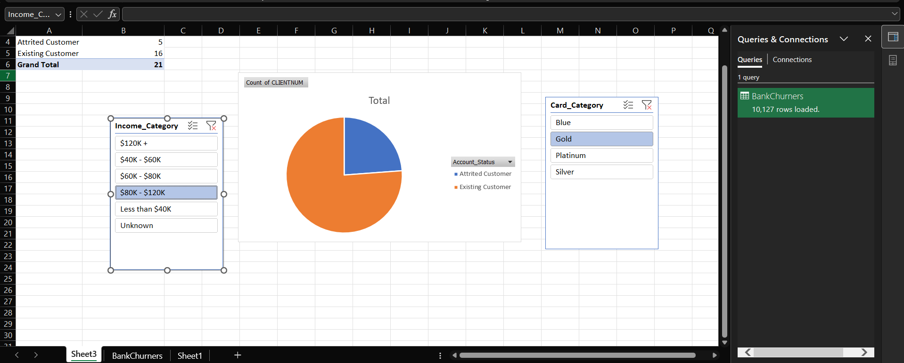

# Bank-Credit-Risk-Excel-Model
Automated ETL pipeline and interactive financial dashboard built using Excel Power Query and Pivot Data Modeling.
# 🏦 Bank Credit Risk & Customer Churn Financial Model

**Author:** Apurv Chaudhari  
**Role:** Data Analyst  
**Tech Stack:** Advanced Microsoft Excel (Power Query, Pivot Data Modeling, Interactive Dashboards)

---

## 📌 Executive Summary
In the retail banking sector, customer attrition (churn) directly impacts top-line revenue and credit portfolio stability. This project focuses on analyzing a dataset of 10,000+ bank customers to identify the primary indicators of account closure. 

By building an automated ETL pipeline and an interactive visualization layer, this model allows risk managers and financial analysts to dynamically filter churn rates across income brackets, credit card tiers, and demographic segments to deploy targeted retention strategies.

---

## 🖼️ Interactive Dashboard Preview
*(Replace this text with your uploaded screenshot on GitHub to showcase your interactive interface)*

---

## 🛠️ Data Architecture & Automation

### 1. Automated ETL Pipeline (Power Query)
* **Data Ingestion:** Connected raw CSV transactional data directly into Excel's backend via Power Query.
* **Automated Cleansing:** Built a macro-free transformation pipeline to automatically strip out redundant machine-learning artifacts, standardize column nomenclature for business users, and ensure strict data typing.
* **Scalability:** The architecture allows for instant refreshing. As new monthly customer data is added to the source directory, the Power Query engine will automatically clean and load the new rows without manual intervention.

### 2. Financial Modeling & Interactive BI 
* **Data Modeling:** Constructed relational PivotTables to aggregate and quantify customer status metrics efficiently, avoiding heavy, processor-intensive formula arrays.
* **Interactive Front-End:** Designed a dynamic, manager-facing dashboard utilizing standard PivotCharts integrated with synchronized Slicers. This allows end-users to instantly cross-filter attrition data by specific `Card_Category` (e.g., Gold, Blue) and `Income_Category` without needing to interact with the raw dataset.

---

## 💡 Strategic Business Value
* **Risk Identification:** Quickly isolates which specific demographic and financial segments are closing accounts at the highest velocity.
* **Targeted Retention:** Enables the marketing and customer success teams to allocate retention budgets efficiently by identifying high-value (high income / premium card) clients at risk of churning.
